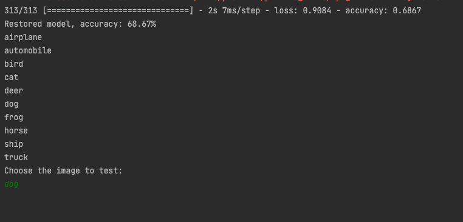
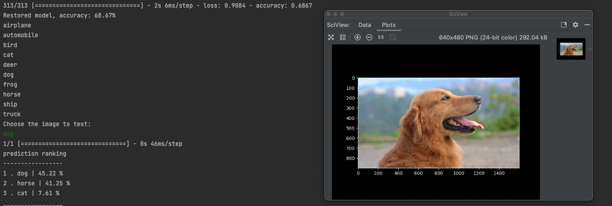

# PictureAnalyzerAI

This is a program that identifies whether the testing picture is one of:
- Airplane
- Automobile
- Bird
- Cat
- Deer
- Dog
- Frog
- Horse 
- Ship
- Truck 



For tests, I uploaded pictures to my AWS S3 and used photos uploaded there to test. If you would like to test your own image, enter the path to your iamge in line 80

This program is trained with CIFAR-10 datasets using python librarby TensorFlow and Keras. If the input picture is one items in the list mentioned above,
the program will output top 3 picks after analyzing the input. 
For ex.
- 1 Dog : 85%
- 2 Cat : 10%
- 3 Horse : 5%



When the program is ran, there will be input to enter which picture the user would like to choose. I have uploaded pictures to my AWS S3 so users can test pictures 
easily. However if the user would like to test their own input, do the following.
- On line 78 replace everything inside io.imread() with the path to the picture on your computer. Make sure the path is inside ''
- For ex. io.imread('/Users/name/Dowloads/Cats_image.jpeg')

## ps
If the result is not printed try to close the pop up window containing the test photo.

# How to Download
- First create virtual environemnt
```
conda create --name env_name python=3.9
```
env_name is your environment name

- activate your env
```
conda activate env_name
```
- After, install requirements
```
pip install -r requirements.txt
```
- Lastly if you are using a mac
```
pip install tensorflow-macos
```
- if windows
``` 
pip install tensorflow
```
set the virtual env before running the program.
